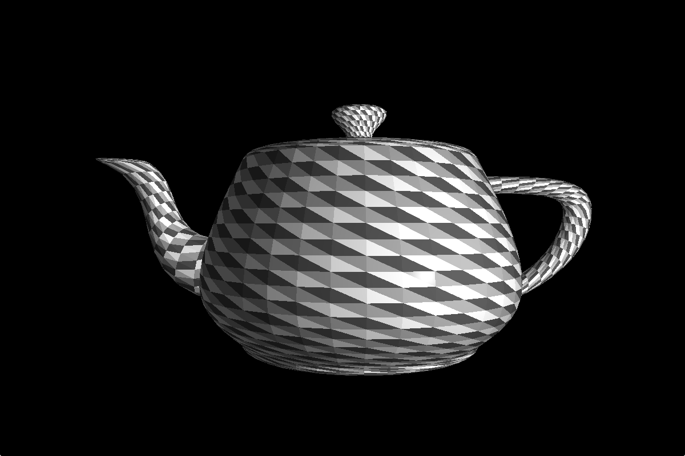
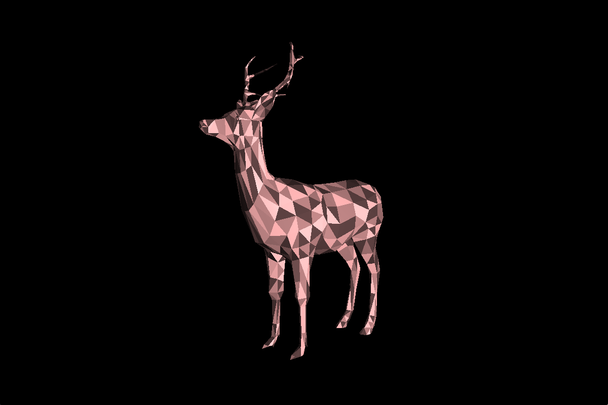

# 3d_visualizer

A 3D visualizer for .obj files written in C.

## Libraries

* OpenGL 4.1
* minilibX

## Usage

In your terminal:  
```sh
git clone https://github.com/4quet/3d_visualizer.git
cd 3d_visualizer
make
```
  
Launch using:  
`./scop <file.obj>` where `<file.obj>` is an **.obj** file describing a 3D model.  
A few .obj files are located in the **models/** directory.  
Example: `./scop models/teapot.obj`

### Key bindings

* **W**: Move forward.
* **S**: Move backward.
* **Left arrow**: Move the object left.
* **Right arrow**: Move the object right.
* **Up arrow**: Move the object up.
* **Down arrow**: Move the object down.
* **+**: Increase the scale of the object.
* **-**: Decrease the scale of the object.
* **Z**: Increase rotation speed.
* **X**: Decrease rotation speed.
* **R**: Toggle auto rotation of the object.
* **T**: Enable texture mode.
* **SPACE**: Change light color.
* **ESCAPE**: Quit.

## Screenshots





